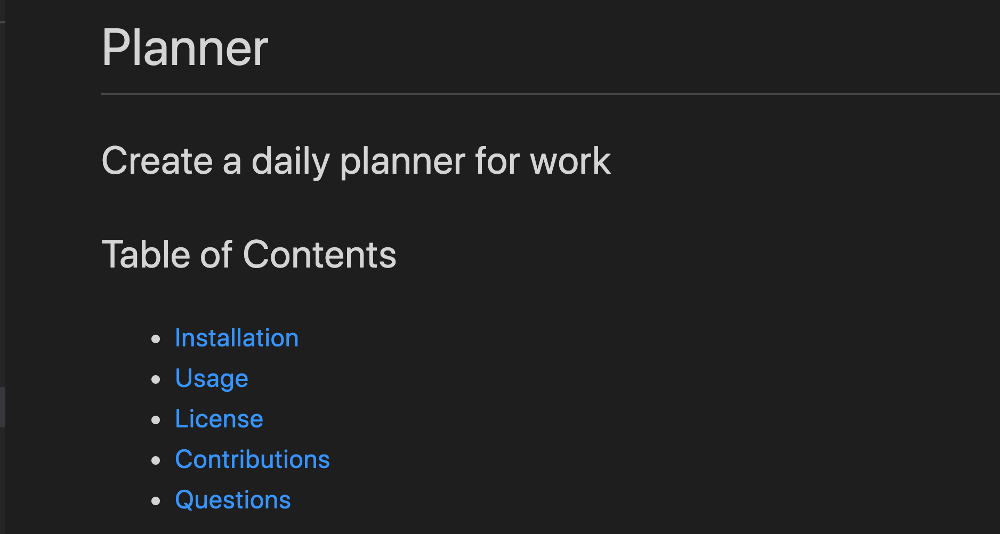
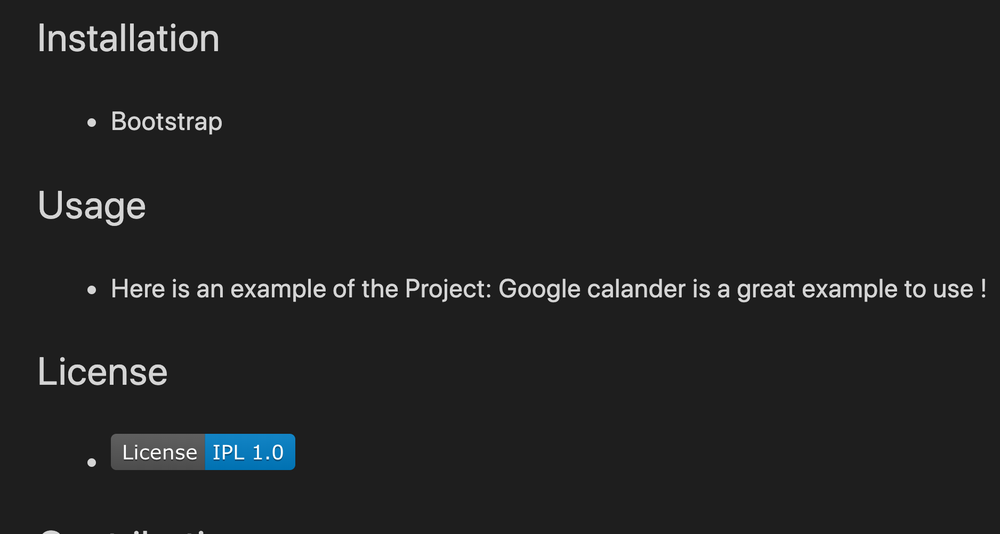
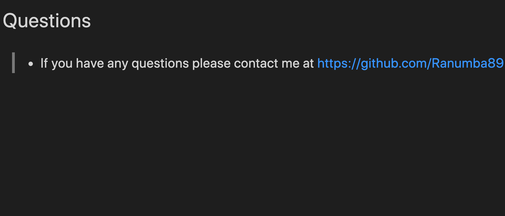
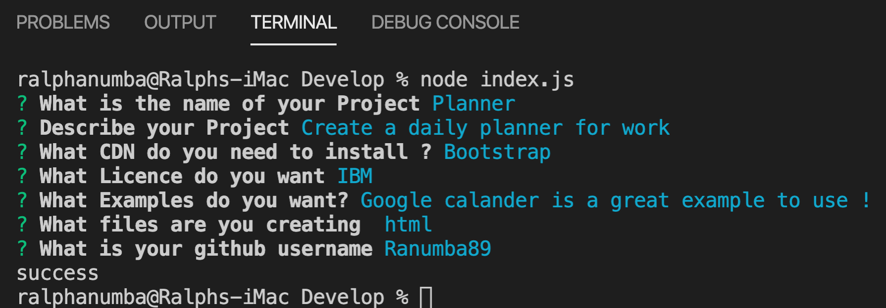

# interactive-readme

Link: https://github.com/Ranumba89/interactive-readme

The table of contents was a key part 

Used choices twice but it was interesting using choices for the licences. Put it in and object but called it like an array hmm..

The contacts 

